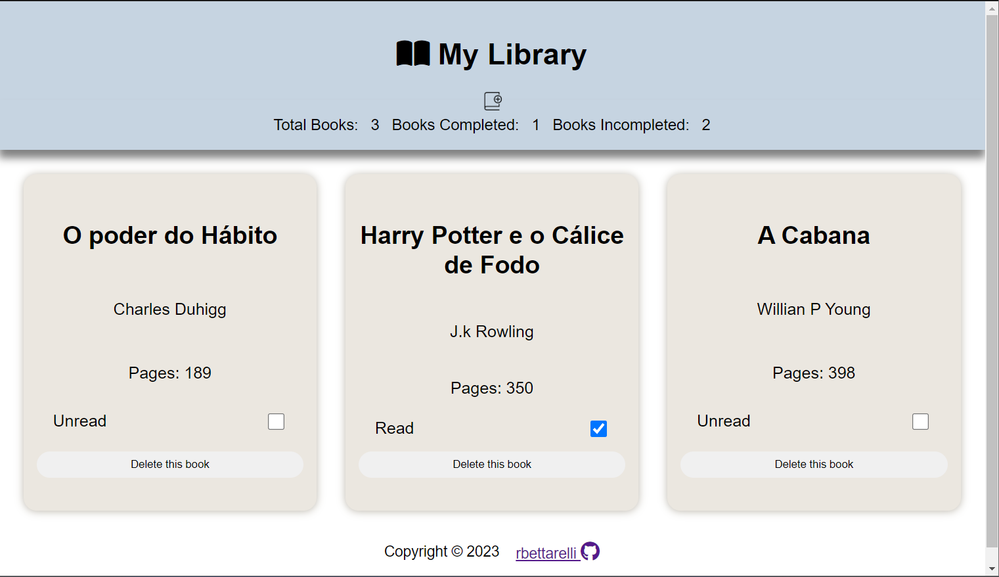

# Library

This is a library application developed using HTML, CSS, JavaScript, and Local Storage. The application is based on basic concepts for storing and updating items within the browser's Local Storage.

## Features

- Book Management: Add, remove, and update books in the library.
- Book Details: View details of each book, including title, author, and publication year.
- Local Storage: The application utilizes the browser's Local Storage to persist book data.

## Usage

To use the Library application, follow these steps:

1. Open the [Library Application](https://github.com/rbettarelli/Library) in a web browser.
2. Use the provided form to add books to the library by entering the title, author, and publication year.
3. The added books will be displayed in the library with their details.
4. To update or remove a book, use the respective buttons next to each book entry.
5. The changes will be automatically saved to the browser's Local Storage.

## Contributing

Contributions to this Library application project are welcome. If you have any ideas, suggestions, or improvements, please feel free to submit a pull request.

## License

This project is licensed under the [MIT License](LICENSE).
